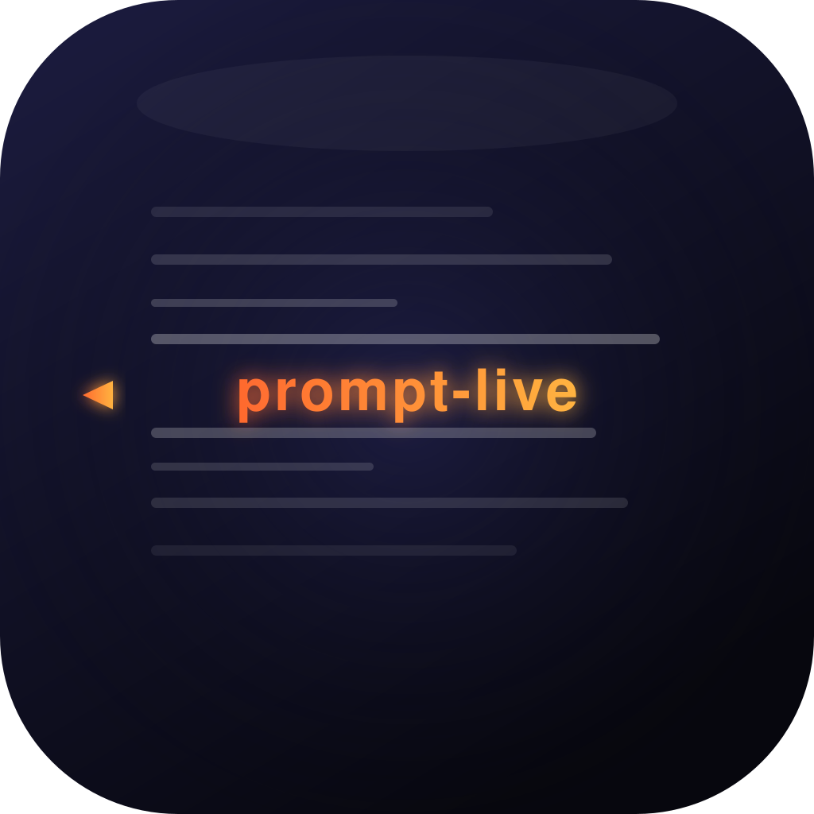
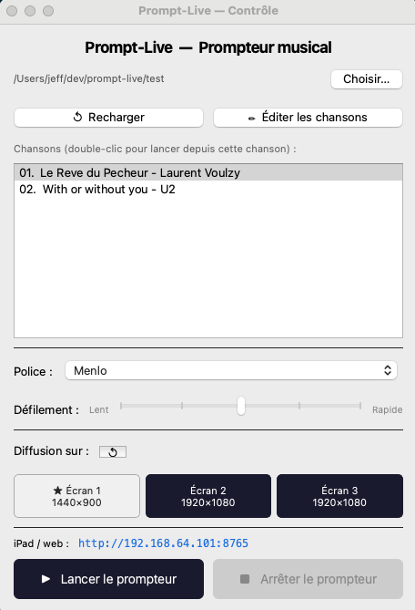
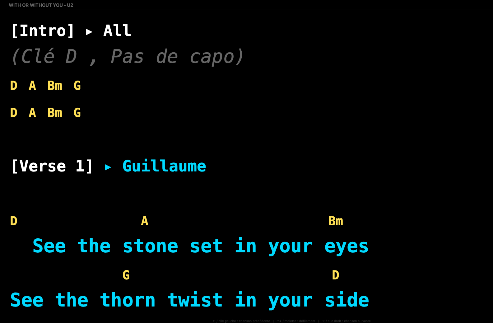
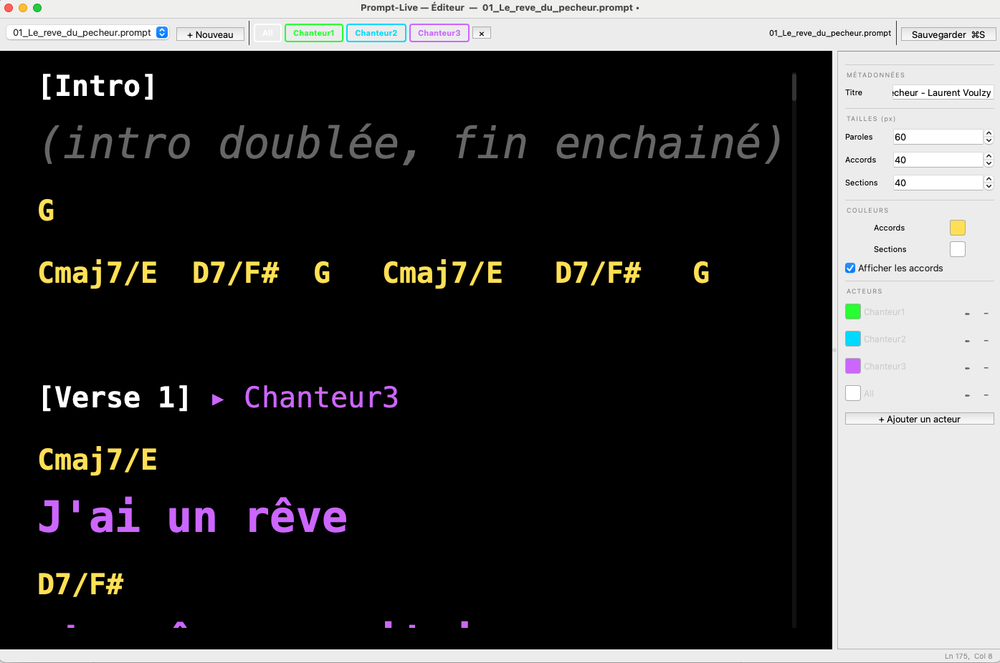

<p align="center">
  
</p>

<h1 align="center">Prompt-Live</h1>
<p align="center"><em>Prompteur musical pour groupes live — paroles & accords sur grand écran</em></p>

<p align="center">
  
  
  
</p>

<p align="center">
  <a href="https://jfpucheu.github.io/prompt-live/">🌐 Site web — jfpucheu.github.io/prompt-live</a>
</p>

---

## Aperçu

| Fenêtre de contrôle | Mode prompteur | Éditeur |
|---|---|---|
|  |  |  |

---

## Présentation

Prompt-Live est une application macOS pour afficher paroles et accords en temps réel sur scène. Elle est pensée pour les groupes avec plusieurs chanteurs : chaque interprète peut être coloré différemment, les accords sont affichés au-dessus des paroles, et tout défile en douceur depuis la table de régie.

**Fonctionnalités principales**

- Chargement d'un dossier de fichiers `.prompt` numérotés (ordre de passage automatique)
- Affichage plein écran sur l'écran externe (retro-projecteur, TV scène…)
- Défilement fluide avec animation, vitesse réglable (5 niveaux)
- Navigation au clavier : ↑↓ défilement, ←→ chanson précédente/suivante
- Support pédalier Bluetooth HID (↓ défile, 2× bas = chanson suivante, 2× haut = chanson précédente)
- Synchronisation iPad/tablette via navigateur web (serveur SSE intégré)
- Support multi-écrans : même ligne en haut sur tous les écrans
- Éditeur intégré avec prévisualisation en direct
- Coloration par chanteur / section
- Polices monospace embarquées (PT Mono) pour un alignement parfait accords/paroles

---

## Installation (développement)

```bash
git clone https://github.com/jfpucheu/prompt-live.git
cd prompt-live
python3 -m venv .venv
source .venv/bin/activate
pip install -r requirements.txt
./run.sh
```

---

## Télécharger l'application

Rendez-vous sur la page [**Releases**](https://github.com/jfpucheu/prompt-live/releases) pour télécharger la dernière version compilée pour macOS :

| Version | Intel (x86_64) | Apple Silicon (M1/M2/M3) |
|---------|---------------|--------------------------|
| Dernière | `Prompt-Live-apple-intel.zip` | `Prompt-Live-apple-silicon.zip` |

Dézipper et glisser `Prompt-Live.app` dans votre dossier Applications.

> **Sécurité macOS** : l'application n'est pas notarisée Apple. Au premier lancement, macOS peut bloquer silencieusement son démarrage. Ouvrir un Terminal et lancer :
> ```bash
> xattr -dr com.apple.quarantine /Applications/Prompt-Live.app
> ```
> Puis lancer l'app normalement.

---

## Format des fichiers `.prompt`

Les fichiers sont de simples fichiers texte avec une syntaxe légère.

### En-tête

```
Titre: Amazing Grace
TailleParoles: 32
TailleAccords: 18
CouleurSection: jaune
CouleurAccords: gris

@Vanessa: Rouge
@Guillaume: Bleu
@Armelle: Violet
```

| Balise | Description | Défaut |
|--------|-------------|--------|
| `Titre:` | Titre affiché | nom du fichier |
| `TailleParoles:` | Taille de police des paroles | `28` |
| `TailleAccords:` | Taille de police des accords | `18` |
| `TailleSection:` | Taille des titres de section | `16` |
| `CouleurSection:` | Couleur des titres de section | `#AAAAAA` |
| `CouleurAccords:` | Couleur des accords | `#888888` |
| `AfficherAccords:` | `oui` / `non` | `oui` |
| `@Prenom: couleur` | Définit la couleur d'un chanteur | — |

### Contenu

```
[Intro]
(Guitare acoustique — capo 2)
G         Cmaj7/E
Amazing grace, how sweet the sound

[Couplet 1]@Vanessa
D          G
That saved a wretch like me @Guillaume
```

| Syntaxe | Effet |
|---------|-------|
| `[Section]` | Titre de section |
| `[Section]@Prenom` | Section entière colorée |
| `Ligne @Prenom` | Ligne individuelle colorée |
| `(note entre parenthèses)` | Note / indication de jeu (italique gris) |
| Ligne courte au-dessus des paroles | Accord (police plus petite) |

### Couleurs disponibles

`rouge` `bleu` `vert` `orange` `jaune` `violet` `cyan` `rose` `blanc` `gris`
Ou code hexadécimal : `#FF8800`

### Ordre de passage

Préfixer les fichiers par un numéro pour définir l'ordre :

```
01_Amazing Grace.prompt
02_Hallelujah.prompt
03_Le Reve du Pecheur.prompt
```

---

## Utilisation

### Lancer un concert

1. Ouvrir Prompt-Live et sélectionner le dossier de chansons
2. Brancher le retro-projecteur / TV scène — il s'affiche automatiquement en plein écran
3. Utiliser la fenêtre de contrôle pour naviguer et régler la vitesse
4. Appuyer sur **Prompter** pour démarrer

### Contrôles clavier (en mode prompteur)

| Touche | Action |
|--------|--------|
| `↑` / `↓` | Défilement |
| `→` / `Page Bas` | Chanson suivante |
| `←` / `Page Haut` | Chanson précédente |

### Pédalier Bluetooth

Tout pédalier Bluetooth reconnu comme clavier HID est supporté nativement. Le filtre de touches fonctionne quelle que soit la fenêtre active (pas besoin que le prompteur soit au premier plan).

| Geste | Action |
|-------|--------|
| Appui pédale bas (`↓`) | Défilement vers le bas |
| 2 appuis consécutifs en bas de page | Chanson suivante |
| Appui pédale haut (`↑`) | Défilement vers le haut |
| 2 appuis consécutifs en haut de page | Chanson précédente |

La pédale peut être **activée / désactivée** et sa **vitesse de défilement** réglée indépendamment dans la fenêtre de contrôle (section *Pédale BT*).

Touches reconnues : `↓`, `Espace`, `F5` (bas) — `↑`, `F6` (haut). Si votre pédale envoie d'autres touches, modifier `_PEDAL_DOWN_KEYS` / `_PEDAL_UP_KEYS` dans `main.py`.

### Synchronisation iPad

Sur le même réseau Wi-Fi, ouvrir un navigateur sur l'iPad et aller sur :

```
http://<IP de l'ordinateur>:8765
```

L'adresse IP est affichée dans la fenêtre de contrôle. La tablette suit le défilement en temps réel.

---

## Build & Release

```bash
# Générer l'icône (si modifiée)
python logo/make_icns.py

# Compiler l'application
./build.sh
# → dist/Prompt-Live.app
```

La CI GitHub Actions produit automatiquement les binaires Intel et Apple Silicon lors d'un push de tag `v*` :

```bash
git tag v1.0.0
git push origin v1.0.0
```

---

## FAQ

**L'app ne démarre pas (aucun message, aucune fenêtre)**
> macOS bloque silencieusement les apps téléchargées non notarisées. Ouvrir un Terminal et lancer :
> ```bash
> xattr -dr com.apple.quarantine /Applications/Prompt-Live.app
> ```
> Puis relancer l'app normalement.

**macOS bloque l'ouverture de l'app ("développeur non identifié")**
> Faire clic droit → **Ouvrir** sur `Prompt-Live.app`. Confirmer dans la boîte de dialogue. À faire une seule fois.

**L'écran externe ne s'affiche pas en plein écran**
> Vérifier que l'écran externe est bien détecté par macOS (Réglages Système → Écrans). Prompt-Live utilise automatiquement le deuxième écran au lancement du mode prompteur. Si branché après le démarrage, relancer le mode prompteur.

**L'iPad ne se connecte pas**
> - Vérifier que l'ordinateur et l'iPad sont sur le **même réseau Wi-Fi**
> - L'adresse IP est affichée dans la fenêtre de contrôle (ex. `http://192.168.1.10:8765`)
> - Désactiver temporairement le pare-feu macOS si la connexion échoue (Réglages Système → Réseau → Pare-feu)
> - Certains réseaux d'entreprise bloquent les connexions locales entre appareils

**Le défilement iPad est décalé par rapport à l'écran principal**
> La sync se fait par numéro de ligne. Si les tailles de police sont très différentes entre l'écran et l'iPad, la ligne affichée peut légèrement différer — c'est normal.

**Les accords sont décalés par rapport aux paroles**
> Utiliser uniquement des polices **monospace** (PT Mono est embarquée et sélectionnée par défaut). Helvetica, Arial et autres polices proportionnelles provoquent un décalage.

**Une chanson n'apparaît pas dans la liste**
> Les fichiers doivent avoir l'extension `.prompt` et être dans le dossier sélectionné. Les fichiers sans numéro de préfixe sont affichés en dernier.

**L'app ne se ferme pas quand un iPad est connecté**
> Fermer la fenêtre de contrôle (croix rouge). Toutes les fenêtres et le serveur web se ferment ensemble. Si l'app reste en fond, forcer la fermeture avec `Cmd+Q`.

**Modifier un fichier `.prompt` depuis un éditeur externe**
> Prompt-Live surveille le dossier automatiquement. Toute modification enregistrée dans un éditeur externe est rechargée en direct sans redémarrer l'app.

---

## Licence

[MIT + Commons Clause](LICENSE) — libre d'utilisation et de modification, mais la revente du logiciel est interdite.
